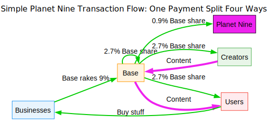

# FOSSialism - 2025
------------------------

The following concerns free software. To be more specific, a set of free, open source repos, apps, and services, which are self-hostable, and deployed for use by everyone. It is very much all a work in progress. 

The [initial README for FOSSialism took a look back at its motivation.][fossialism]

This will take a look forward. 

If you haven't read the first README, here are the pieces to know about:

* [The Stack][stack] - The set of open source protocols built with and on top of Sessionless that enable, among other things, profit sharing from transactions.

* [allyabase][allyabase] - The public BaaS that Sessionless enables

* [The Nullary][nullaris] - The set of interoperable client applications that utilize allyabase and The Stack.

* [The Advancement][advancement] - The apps that handle keys for interaction with software using The Stack's protocols.

## The base

At the center of all of this is a backend running allyabase that we call a base. 
If you like to read (or summarize things via AI), [here's a blog post on the concept.][base]

Please note the use of the color green to indicate money flowing into your pockets. 

allyabase has everything you need to build lots of apps. 
the [MAGIC][magic] protocol lets you add people, places, and groups into transactions so that instead of relying on centralized authorities to split up surplus value, you can bake that into the transaction directly. 

The point of bases is to build communities, like old school forums, but instead of communication, a base is focused on transactions (whether moneyed or not-moneyed). 
The protocols let the bases federate and/or let users join multiple bases. 
So for example, a local grocery store might be part of the neighborhood base, and a veggie-friendly base, and an eat-local base. 
Users of all of these bases could then purchase from the local store instead of Amazon-owned Whole Foods. 

## The Nullary

As I started rolling this out, it became clear that one of the things to do with it was destroy the garbage rent-seeking SaaS sewer that tech has imposed on businesses. 
Setting up a restaurant? 
How's $100/mo for reservations, and $150/mo for your POS, and $90/mo for inventory management, and blah blah blah.

So I started building these no-cruft versions of a lot of popular SaaS apps, and it's actually been pretty fun.
So, after I finish some of the base line ones (SoMa[^1] apps and blogging and eCommerce), right now I think I might just keep building them out.

The key is (pun intended), all of these apps can work together if users want them to.
No need for a million different accounts, just one user to rule them all.
That's the power of [Sessionless][sessionless].

## The Advancement

It is in the nature of socio-politico-economic discourse that pretty much whatever -ism you attach yourself to will alienate more people than not--if only because most people just don't care.
So here's what I'm trying to do: take money from the gigantocorps of Google, Meta, and Amazon, and redistribute it to basically anyone who doesn't already own an island and/or rocket ship.
For me this aligns with my conception of socialism, whatever it aligns with for you is your own business.

The software doesn't care, and beliefs aren't codified.
What is codified is that ads suck.
Many people have tried to block them, and that has led Google to adopt a new manifest for extensions that limits their ability to block them. 
So we're not going to fight on that front. 

Instead we're going to cover them up.

https://github.com/user-attachments/assets/65c80e01-d955-4875-8219-ffaad91ebb5f

Now you could imagine different kinds of interactions with this extension.
Say one which would allow a blogger to benefit from your next purchase _regardless of whether that purchase was made on their site or not!_
The bases you join keep what your buying relevant to you, and anyone can benefit.

## Roadmap

There are two bases in production, and processing transactions right now. 
I won't link them in case they tip, but there are dev deployments at dev|ent|ind.<service>.allyabase.com

The client apps are coming in the next month or so.

The Advancement I'm hoping to have out by the end of the year. 

I'll add a graphic if and when I feel more confident.

## Conclusion 

If you've made it this far, thanks for reading.
It's hard for things not to come off like selling things, but I want to assure you I'm not trying to sell you something here.
I'm just guy with a computer, big dreams, and a plan[^2], and today seemed like a good day to share.

[fossialism]: https://github.com/planet-nine-app/planet-nine/blob/main/FOSSialism.md
[allyabase]: https://www.github.com/planet-nine-app/allyabase
[stack]: https://www.github.com/planet-nine-app/planet-nine/The%20Stack.md
[nullaris]: https://github.com/planet-nine-app/nullaris
[advancement]: https://github.com/planet-nine-app/the-advancement
[base]: https://opensource-force.github.io/osf-blog/posts/back-to-base-ics/
[magic]: https://github.com/planet-nine-app/MAGIC
[sessionless]: https://github.com/planet-nine-app/sessionless

[^1]: SoMa is short for Social Media. Whatever else it may be evocative of is incidental. 
[^2]: "If Die Antwort would like some royalties, from my usage of a line of theirs here, they can send me their Sessionless public keys :)"

