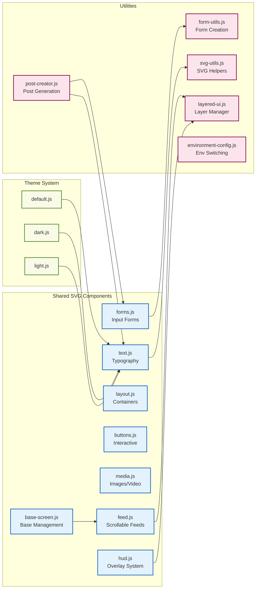
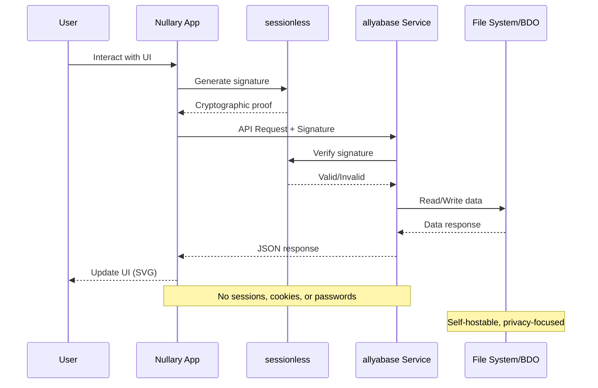
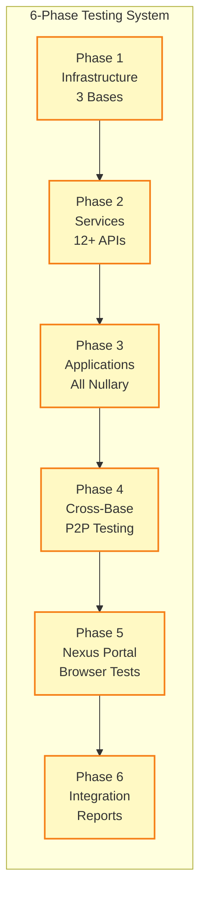

# Planet Nine Ecosystem Architecture

## Complete Ecosystem Overview

```mermaid
graph TB
    subgraph "Client Layer - the-nullary"
        subgraph "Social Apps"
            blogary[blogary<br/>Text Blogging]
            eventary[eventary<br/>Event Management]
            postary[postary<br/>General Posting]
            screenary[screenary<br/>Multi-Purpose Social]
            viewaris[viewaris<br/>Short Videos]
            wikiary[wikiary<br/>Wiki/Knowledge]
            rhapsold[rhapsold<br/>Minimalist Blog]
            lexary[lexary<br/>Text Feeds]
            photary[photary<br/>Photo Sharing]
        end
        
        subgraph "Commerce Apps"
            ninefy[ninefy<br/>Digital Marketplace]
        end
        
        subgraph "Communication Apps"
            stackchat[StackChat<br/>P2P Messaging]
        end
        
        subgraph "Aggregation Apps"
            mybase[MyBase<br/>Multi-Base Content]
        end
        
        subgraph "Web Portal"
            nexus[Nexus<br/>Ecosystem Portal]
        end
    end
    
    subgraph "Protocol Layer - The Stack"
        sessionless[sessionless<br/>Cryptographic Auth<br/>secp256k1 Keys]
        magic[MAGIC<br/>Payment Protocol<br/>MP/Nineum Currency]
        teleportation[teleportation<br/>Content Discovery]
        advancement[the-advancement<br/>Browser Extensions<br/>Privacy Protection]
    end
    
    subgraph "Backend Layer - allyabase"
        subgraph "Core Services"
            bdo[bdo<br/>Big Dumb Object<br/>Storage]
            continuebee[continuebee<br/>State Verification]
            pref[pref<br/>Key/Value Prefs]
        end
        
        subgraph "Content Services"
            sanora[sanora<br/>Product Hosting<br/>Marketplace]
            dolores[dolores<br/>Video Storage<br/>Tagging]
        end
        
        subgraph "Commerce Services"
            addie[addie<br/>Payment Processing<br/>Split Transactions]
            aretha[aretha<br/>Limited Products<br/>Tickets/Rentals]
            fount[fount<br/>MAGIC Integration<br/>Rewards]
        end
        
        subgraph "Communication Services"
            julia[julia<br/>P2P Messaging<br/>Associations]
            minnie[minnie<br/>Email Handling]
        end
        
        subgraph "Account Services"
            joan[joan<br/>Account Recovery]
        end
    end
    
    subgraph "Infrastructure"
        subgraph "Multi-Base Architecture"
            base1[Base 1<br/>Port 1000-1122]
            base2[Base 2<br/>Port 2000-2122]
            base3[Base 3<br/>Port 3000-3122]
        end
        
        docker[Docker<br/>Containerization]
        pm2[PM2<br/>Process Management]
        testing[Test Suite<br/>6-Phase Validation]
    end
    
    %% Client to Protocol connections
    blogary --> sessionless
    eventary --> sessionless
    postary --> sessionless
    screenary --> sessionless
    viewaris --> sessionless
    wikiary --> sessionless
    rhapsold --> sessionless
    ninefy --> sessionless
    lexary --> sessionless
    photary --> sessionless
    stackchat --> sessionless
    mybase --> sessionless
    nexus --> sessionless
    
    ninefy --> magic
    screenary --> magic
    
    %% Protocol to Backend connections
    sessionless --> continuebee
    sessionless --> joan
    
    magic --> addie
    magic --> fount
    
    teleportation --> bdo
    teleportation --> sanora
    
    %% App to Service connections
    blogary --> sanora
    rhapsold --> sanora
    rhapsold --> bdo
    
    ninefy --> sanora
    ninefy --> bdo
    ninefy --> addie
    ninefy --> aretha
    
    viewaris --> dolores
    viewaris --> bdo
    
    screenary --> bdo
    screenary --> sanora
    screenary --> dolores
    screenary --> pref
    
    stackchat --> julia
    stackchat --> bdo
    
    lexary --> bdo
    photary --> bdo
    mybase --> bdo
    
    nexus --> bdo
    nexus --> sanora
    nexus --> dolores
    
    %% Infrastructure connections
    base1 --> docker
    base2 --> docker
    base3 --> docker
    docker --> pm2
    docker --> testing
    
    %% Browser Extension
    advancement -.-> |"Protects"| blogary
    advancement -.-> |"Protects"| eventary
    advancement -.-> |"Protects"| postary
    advancement -.-> |"Protects"| screenary
    advancement -.-> |"Protects"| viewaris
    advancement -.-> |"Protects"| wikiary
    advancement -.-> |"Protects"| rhapsold
    advancement -.-> |"Protects"| ninefy
    advancement -.-> |"Protects"| nexus
    
    classDef client fill:#e1f5fe,stroke:#01579b,stroke-width:2px
    classDef protocol fill:#f3e5f5,stroke:#4a148c,stroke-width:2px
    classDef backend fill:#e8f5e9,stroke:#1b5e20,stroke-width:2px
    classDef infra fill:#fff3e0,stroke:#e65100,stroke-width:2px
    
    class blogary,eventary,postary,screenary,viewaris,wikiary,rhapsold,ninefy,lexary,photary,stackchat,mybase,nexus client
    class sessionless,magic,teleportation,advancement protocol
    class bdo,continuebee,pref,sanora,dolores,addie,aretha,fount,julia,minnie,joan backend
    class base1,base2,base3,docker,pm2,testing infra
```

## Shared Component Architecture

## Data Flow Architecture

## Testing Infrastructure

This diagram shows the complete Planet Nine ecosystem with all its layers, connections, and architectural patterns!